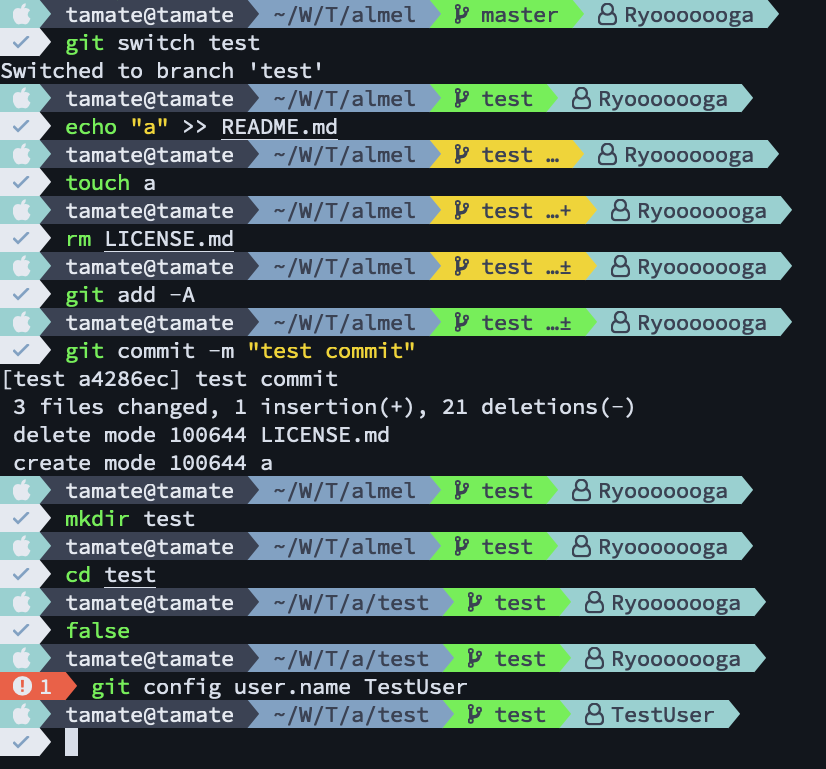

# Almel

[](https://github.com/Ryooooooga/almel/actions)
[](https://crates.io/crates/almel)

A ZSH theme inspired by [agnoster-zsh-theme](https://github.com/agnoster/agnoster-zsh-theme), written in Rust.



## Installation

### From source

```sh
cargo install almel
```

### From Homebrew

```sh
brew install ryooooooga/tap/almel
```

### From precompiled binary

I provide precompiled binary in [releases](https://github.com/Ryooooooga/almel/releases).

### Bash

Add the following to your `.bashrc`.

```bash
eval "$(almel init bash)"
```

### Zsh

Add the following to your `.zshrc`.

```zsh
eval "$(almel init zsh)"
```

Enable asynchronous prompt (requires [zsh-async](https://github.com/mafredri/zsh-async)).

```zsh
eval "$(almel init zsh --async)"
```

### Fish

Add the following to your `~/.config/fish/config.fish`:

```fish
almel init fish | source
```

## Configuration

Almel looks for the configuration file at the following paths:

1. `$ALMEL_CONFIG_FILE`
2. `$XDG_CONFIG_HOME/almel/almel.yml`
3. `$HOME/.config/almel/almel.yml`
